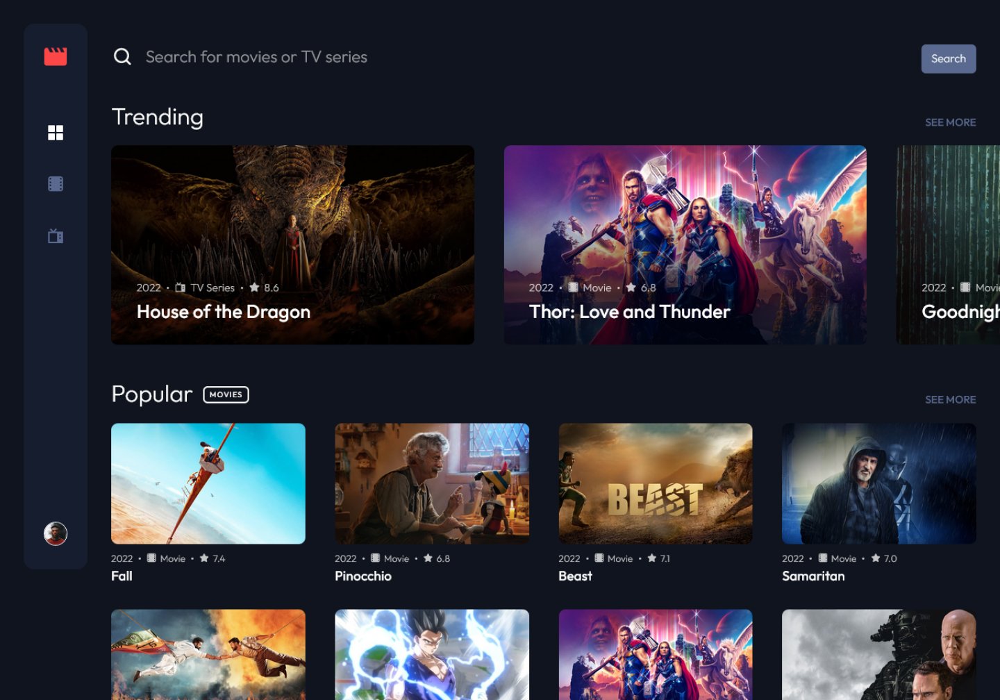
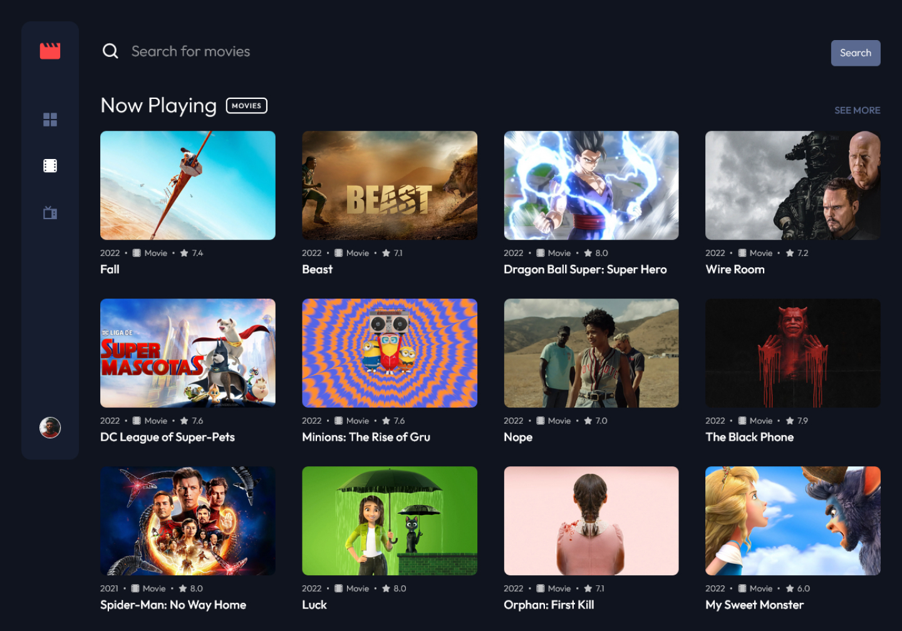
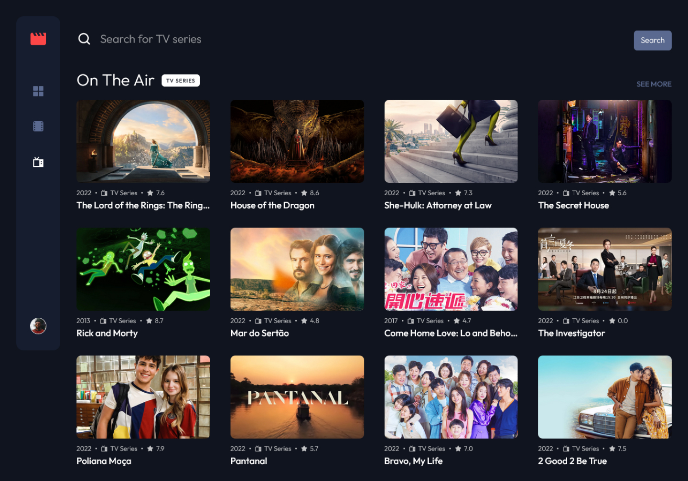
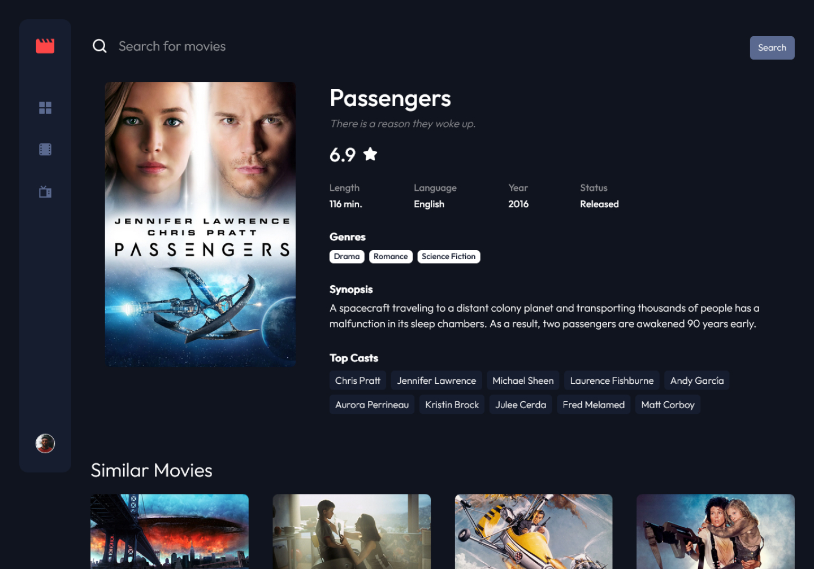

# Entertainment web app

## Table of contents

- [Overview](#overview)
  - [Summary](#summary)
  - [Links](#links)
  - [Screenshot](#screenshot)
- [My process](#my-process)
  - [Project purpose and goal](#project-purpose-and-goal)
  - [Built with](#built-with)
  - [What I learned](#what-i-learned)
  - [Future improvements](#future-improvements)
  - [Useful resources](#useful-resources)
- [Getting started](#getting-started)
  - [Prerequisites](#prerequisites)
  - [Installing](#installing)
- [Contributing](#contributing)
- [Author](#author)

## Overview

### Summary

An entertainment web app built with Next.js and Styled Components that allows users to search for movies and tv shows.

### Links

- Solution URL: [GitHub](https://github.com/lianpaulm/entertainment-web-app)
- Live Site URL: [Vercel](https://lp-entertainment.vercel.app/)

### Screenshot










## My process

### Project purpose and goal

The main purpose of this project is to take advantages of the capabilities of Next.js and have a functional web app up and running quickly. Secondly, I want to become familiar with the framework itself and its convenient features.

### Built with

- Semantic HTML5 markup
- Flexbox
- CSS Grid
- Mobile-first workflow
- [Next.js](https://nextjs.org/) - React framework
- [Styled Components](https://styled-components.com/) - For styles
- [useSWR](https://swr.vercel.app/) - For client-side data fetching

### What I learned

There are many lessons that I have learned from building this application. However, there are 3 most important lessons that I got out of it.

1. Have a better understanding of the pre-rendering concept in nextJS, and using different methods for fetching data from the API, specifically by using `getStaticProps` and `getServerSideProps`. Next.js provides different ways for data fetching depending on our needs. They do also suggest developers the ideal situation to use them. For me, I combined all of them in different parts of the application.
2. Using `useSWR` to implement pagination in the search result pages and the "see more" pages.
3. Have a better understanding of the error `Cannot read Property 'slice' of Undefined`. Whenever we need to fetch the data from external API, we should make sure that the data exists before we use it in our application. Let say we want an array of movies to be rendered to the UI, but the data is not available yet. According to [this article](https://bobbyhadz.com/blog/javascript-cannot-read-property-slice-of-undefined), we have various solution for this error. The one that I find easiest to understand is to provide an empty fallback value like so: `const arr = data.slice(0, 10) || []`.

### Future improvements

- [ ] Add a bookmark page to store the user's favorite movies and tv shows
- [ ] Add the trailer video playing feature in movie/tv-series details
- [ ] Add authentication so that the user can sign up and log in to save their favorite movies and tv shows permanently

### Useful resources

- [Solution for Cannot read Property 'slice' of Undefined](https://bobbyhadz.com/blog/javascript-cannot-read-property-slice-of-undefined)
- [How to get all available pages in the same request?](https://www.themoviedb.org/talk/55aa2a76c3a3682d63002fb1?language=en)

## Getting started

These instructions will get you a copy of the project up and running on your local machine for development and testing purposes.

### Prerequisites

1. Create an API KEY for the [TMDB API](https://www.themoviedb.org/documentation/api)
2. Create an `.env.local` file in the root directory of the project
3. Add 1 environment variables to the `.env.local` file:

```env
// .env.local
TMDB_API_KEY="YOUR_TMDB_API_KEY"
```

### Installing

Clone the repository and run the development server:

```bash
npm install
npm run dev
# or
yarn install
yarn dev
```

## Contributing

Please feel free to send pull request if you want to contribute!

## Author

- Website - [lianpaulmolo](https://lianpaulmolo.vercel.app)
- Frontend Mentor - [@lianpaulm](https://www.frontendmentor.io/profile/lianpaulm)
